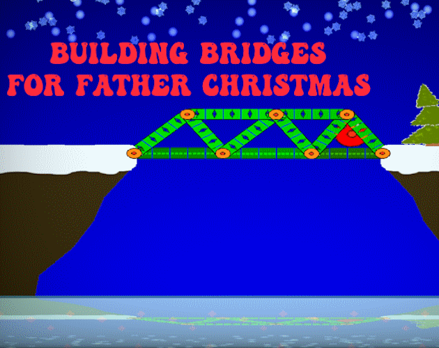

# BridgeBuilder

Entry for libgdx game jam #35 (December 2025).
Bridge builder game with a Christmas theme.
Makes use of box2d for physics.

  

Drag to place a deck (bridge surface), wooden beams, steel beams or cables.
Use double click or right mouse button click to delete items.

Shortcut keys:

- G to go (run physics)
- R to retry
- C to clear
- S to save
- L to load
- 1 for deck mode
- 2 for wooden beam mode
- 3 for steel beam mode
- 4 for cable mode
- N next level
- P previous level
- F11 toggle full screen
- D show physics debug outlines

## Platforms

- `core`: Main module with the application logic shared by all platforms.
- `lwjgl3`: Primary desktop platform using LWJGL3; was called 'desktop' in older docs.
- `teavm`: Web backend that supports most JVM languages.

